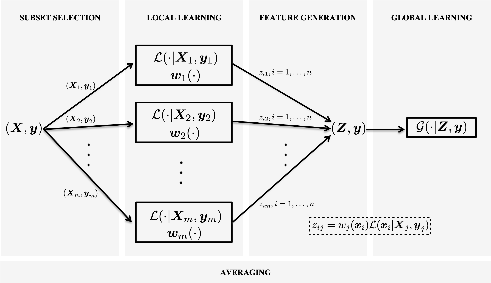

# LESS-R
Learning with Subset Stacking (R version)

LESS is a supervised learning algorithm that is based on training many local estimators on subsets of a given dataset, and then passing their predictions to a global estimator. You can find the details about LESS in our [manuscript](https://arxiv.org/abs/2112.06251).



## Installation

```
install.packages("less")
library(less)
```

## Testing

Here is how you can use LESS:

```r
install.packages("caret")
install.packages("MLmetrics")
library(caret)
library(MLmetrics)

### CLASSIFICATION ###

# Load data
data(iris)

# Train and test split
split_list <- train_test_split(iris, test_size =  0.3)
X_train <- split_list[[1]]
X_test <- split_list[[2]]
y_train <- split_list[[3]]
y_test <- split_list[[4]]

# LESS fit() & predict()
lessclassifier <- LESSClassifier$new(random_state = 2022)
lessclassifier$fit(X_train, y_train)
preds <- lessclassifier$predict(X_test)
table <- caret::confusionMatrix(data=factor(preds), reference = factor(y_test))
cat("Test accuracy of LESS: ", table$overall[["Accuracy"]])

### REGRESSION ###

# Load data
data(abalone)

# Train and test split
split_list <- train_test_split(abalone, test_size =  0.3)
X_train <- split_list[[1]]
X_test <- split_list[[2]]
y_train <- split_list[[3]]
y_test <- split_list[[4]]

# LESS fit() & predict()
less_model <- LESSRegressor$new(random_state = 2022)
less_model$fit(X_train, y_train)
y_pred <- less_model$predict(X_test)
mse <- MLmetrics::MSE(y_pred, y_test)
cat("Test error of LESS: ", mse)

```

## Tutorials

Our **two-part** [tutorial on Colab](https://colab.research.google.com/drive/1UE894I8mIUrLN5kUzg0EB0cWM_50Dqsc?usp=sharing) aims at getting you familiar with LESS regression.


## Recommendation

Default implementation of LESS uses Euclidean distances with radial basis function. Therefore, it is a good idea to scale the input data before fitting. This can be done by setting the parameter `scaling` in `LESSRegressor` or `LESSClassifier` to `TRUE` (this is the default value)

## Python Version

Python implementation of LESS is available in [another repository](https://github.com/sibirbil/LESS).

## Citation

Citation for our software can be reached by:

`citation("less")`

or 

````
To cite package ‘less’ in publications use:

  Birbil I, Cavdar B (2022). _less: Learning with Subset Stacking_. R package version 0.1.0, <https://CRAN.R-project.org/package=less>.

A BibTeX entry for LaTeX users is

  @Manual{,
    title = {less: Learning with Subset Stacking},
    author = {Ilker Birbil and Burhan Ozer Cavdar},
    year = {2022},
    note = {R package version 0.1.0},
    url = {https://CRAN.R-project.org/package=less},
  }
````
